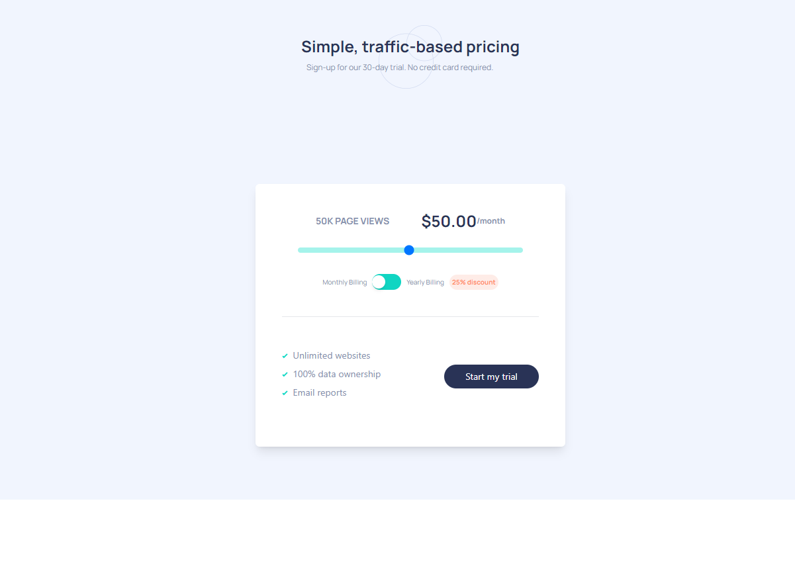
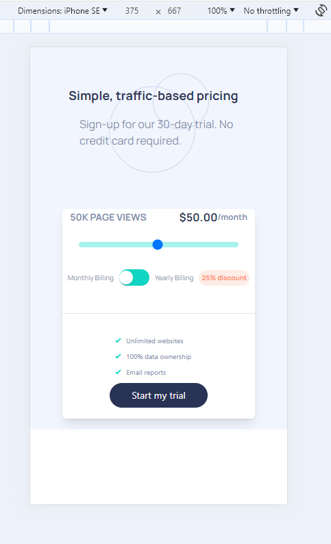

# Frontend Mentor - Interactive pricing component solution

This is the solution page to the interactive pricing activity that involves a price slider, layout and design.

This is a solution to the [Interactive pricing component challenge on Frontend Mentor](https://www.frontendmentor.io/challenges/interactive-pricing-component-t0m8PIyY8). Frontend Mentor challenges help you improve your coding skills by building realistic projects. 

## Table of contents

- [Overview](#overview)
  - [The challenge](#the-challenge)
  - [Screenshots](#screenshots)
  - [Links](#links)
- [My process](#my-process)
  - [Built with](#built-with)
  - [What I learned](#what-i-learned)
  - [Continued development](#continued-development)
  - [Useful resources](#useful-resources)
- [Author](#author)
- [Acknowledgments](#acknowledgments)

## Overview

This project aimed to develop an interactive pricing tool, featuring a dynamic and user-friendly interface. The core of the application is a slider that allows users to adjust pricing based on their needs, complemented by a toggle switch for different billing cycles. The design incorporates a modern aesthetic with custom colors, fonts, and responsive layouts, ensuring an engaging user experience across all devices. The challenge, sourced from [Frontend Mentor](https://www.frontendmentor.io/challenges/interactive-pricing-component-t0m8PIyY8), provided a practical scenario to enhance coding skills through the creation of a realistic project component.

### The challenge

Users should be able to:

- View the optimal layout for the app depending on their device's screen size
- See hover states for all interactive elements on the page
- Use the slider and toggle to see prices for different page view numbers

### Screenshots

### Links

- Solution URL: [Laura Developer Solution](https://www.frontendmentor.io/solutions/reactjs-tailwindcss-vite-interactive-pricing-tool-BQeKEFSq2R)
- Live Site URL: [Laura Developer Interactive Pricing Tool](https://pricingtool-lauradev.netlify.app/)

## My process

The development of this application commenced with an analysis of the design layout and the features that needed implementation. The initial steps involved setting up a GitHub repository and initializing it, followed by the installation of ReactJS, TailwindCSS, and the project's selected Google Fonts. I also customized the Tailwind configuration to incorporate the project's color scheme.

Before diving into the coding phase, I dedicated time to understanding the project's scope, its constraints, and the overall build strategy. 

The construction of the website began from the top, adhering closely to the design specifications. I  integrated all the provided copy into the website. The initial focus was on implementing the background image and the main title, including the addition of the pattern circles image behind the title for enhanced visual appeal. Progressing downwards, I worked on the content box featuring the interactive pricing tool and model, methodically designing each component.

The slider, being one of the components I was least familiar with, posed a challenge but was eventually able to learn the process as I progressed. Another key task was the implementation of the toggle button for monthly billing, which involved dynamically adjusting the pricing displayed within the content box based on the slider values.

After completing the main components, I shifted my focus to refining the design details, ensuring a cohesive and visually appealing interface. The final phase of development was dedicated to optimizing the website for mobile devices, adjusting the formatting and layout to ensure a seamless user experience across all screen sizes.

The project concluded with an update to the README file, marking the achievement of all set objectives for the challenge.

This project was not only a test of my technical skills but also an invaluable learning experience. It enhanced my understanding of the planning process, navigating through unfamiliar coding challenges, and the importance of attention to detail. Overall, it was a fun project to work on.

### Built with

- Semantic HTML5 markup
- CSS custom properties
- Flexbox
- Mobile-first workflow
- [React](https://reactjs.org/) - JS library
- Google Fonts
- Vite

### What I Learned

1. **TailwindCSS Content Configuration**: Initially, my `tailwind.config.js` file had an empty content array, which led to no styles being generated. Tailwind relies on this array to scan files for class names. By including paths to all relevant HTML, JavaScript, and JSX files, I ensured Tailwind could effectively generate the necessary styles.

2. **Custom Colors in Tailwind**: The project required the use of specific custom colors. I learned to extend the Tailwind configuration under the `theme` section to include these colors. This allowed me to use the custom colors throughout the project by referencing their keys, seamlessly integrating the design's color scheme.

3. **Positioning Techniques**: This project deepened my understanding of relative and absolute positioning, especially for layering images such as the background and pattern circles. Setting a container to relative positioning provides a reference point for absolutely positioned elements within it, facilitating layout control.

4. **Using Images as List Item Markers**: TailwindCSS doesn't directly support dynamic values in class names, which posed a challenge when trying to use an image as a list item marker. I overcame this by defining a custom class in my global CSS file and applying it within my JSX, showcasing the flexibility of combining Tailwind with custom CSS for unique requirements.

5. **Building an Interactive Slider**: Prior to this project, I had no experience with interactive sliders. I learned about managing the slider's state to reflect its current value and implemented an `onChange` event handler to update this state whenever the slider's value changed. Ensuring the input's type was set to `range` was crucial for the slider functionality.

6. **Extending Font Sizes in Tailwind**: Tailwind's predefined font sizes didn't include one small enough for a specific design requirement. I extended the Tailwind configuration to include a custom `xxs` font size, demonstrating the ease of customizing Tailwind to fit project-specific needs.

7. **Enhancing Button Interactivity with Hover States**: Adding a hover state to the "Start My Trial" button reinforced the importance of interactive elements in UI design. By utilizing Tailwind's `hover:` prefix, I was able to create a visually responsive button that enhances user experience.

### Continued development

I will continue to work on different functionalities to create more interactive pieces of a website. I really enjoyed learning about the slider and toggle button and would like to include that more in my processes.

### Useful resources

- [Google Fonts Manrope](https://fonts.google.com/specimen/Manrope) - This was the selected Google Fonts styling page.
- [Flowbite TailwindCSS Slider](https://flowbite.com/docs/forms/range/) - This was the resource for the slider element
- [TailwindCSS Border Radius](https://tailwindcss.com/docs/border-radius) - This was a used resource for rounding buttons and objects.
- [TailwindCSS Responsive Design](https://tailwindcss.com/docs/responsive-design)

## Author

- Website - [Laura V](https://lauradeveloper.com/)
- Frontend Mentor - [@lavollmer](https://www.frontendmentor.io/profile/lavollmer)
- Github - [@lavollmer](https://github.com/lavollmer)
